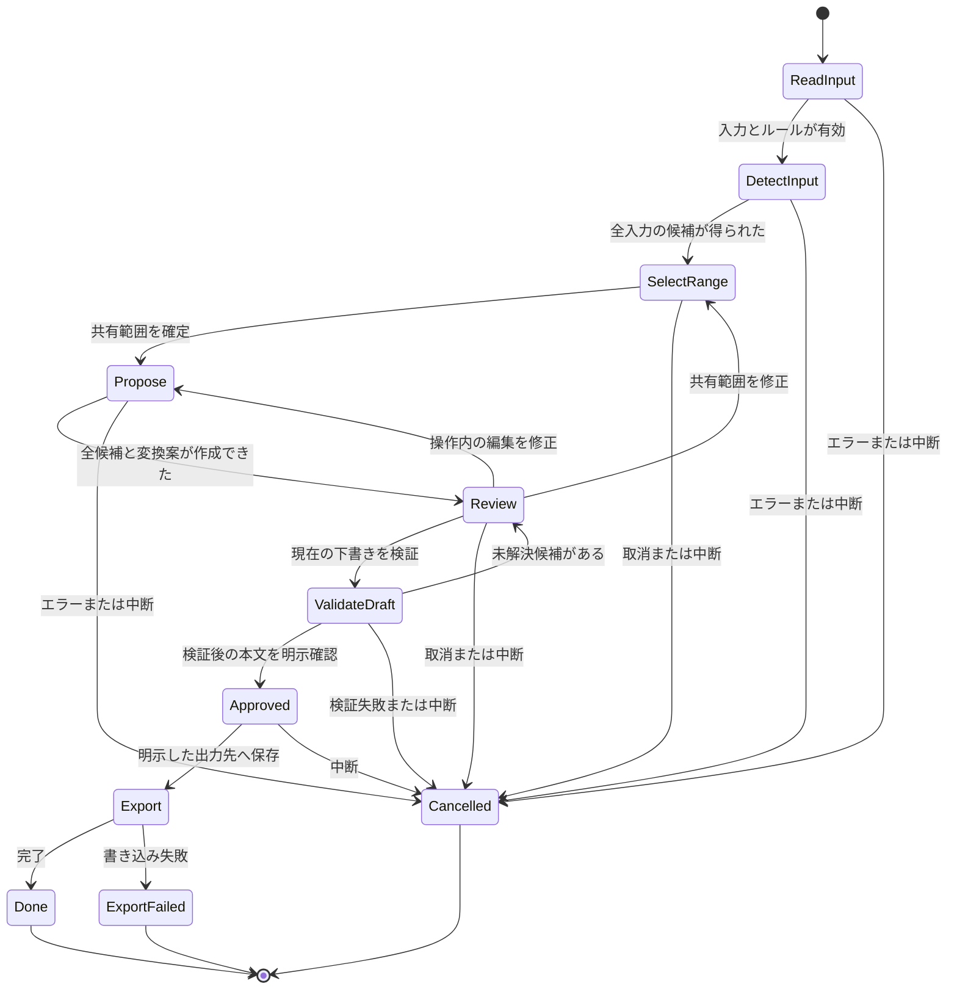

# ops-whisper 設計

更新日：2026-10-08。状態：実務の主要な負担との不一致により保留した設計案。本体実装は未着手。初期対象：macOSの対話CLI。Linuxはコアの互換性確認対象、Windowsの対話操作は初版の保証対象外。

[構想と事業優先度の検証](PRODUCT_REVIEW.md)で、直接代替との重なりを確認した。既存手段で不足が残った場合だけ本設計を実装する。[実行タスク](TASKS.md)と[操作案](REVIEW_FLOW.md)を併せて使う。

現在の完成目標は[PF-1：小さなCLIのポートフォリオ](MILESTONES.md#現行の到達目標)。[資料から暫定設計を整理する検証](REQUIREMENTS_RECOVERY.md)も参照用として保留する。本書は初期の伏字CLIの設計記録であり、XLSX・PDF・PPTX解析やログ集計を実装する仕様ではない。

本書は保留した`review`の設計である。実装した`search`は別契約の[SEARCH_CLI.md](SEARCH_CLI.md)を参照する。検索は別契約の[TOMLマスキング](MASKING.md)を持つ。本書の対話レビュー・別名化・共有承認契約を実装したものではない。

## 1. 目的と成功条件

指定された一つのログを、説明に必要な順序と関係を保ちながら共有用に編集する。成功は、利用者が手作業より少ない負担で、置換理由と取りこぼしを確認できること。検出件数の多さ、暗号学的な匿名化、セキュリティ保証は成功条件にしない。

以前に確認できた実務は、収集ログを根拠にインフラの稼働状態・用途を分析し、その結果を提出する作業。主要な負担は結論と証拠を対応付けて提出物にまとめることだった。そのため本設計を保留し、[報告の手順](INFRA_REPORT_WORKFLOW.md)を整理した。現在はsearchのポートフォリオ完成を優先し、本設計と報告手順を次の実装列にしない。販売可能性も未検証。主力開発を中断する大型基盤として扱わない。

## 2. 初版の範囲

| 含める | 初版では含めない |
| --- | --- |
| 明示指定した一つのUTF-8ファイル、または標準入力 | 履歴全体、ディレクトリ再帰、常時監視、PTY傍受 |
| 共有する一つの連続行範囲、操作内のリテラル置換 | 自動要約、原因推定、インフラの役割判定 |
| 案件固有の任意ルールファイル | 外部へ送信する検出器、AI判定、秘密値の有効性確認 |
| 限定された秘密候補検出 | 個人情報・機密情報の網羅検出、独自検出器の研究 |
| 操作内で一貫した別名、秘密値の固定マスク | 操作をまたぐ対応表、実名復元ファイル |
| 置換候補の確認、手動修正、個別候補の非機密判断 | 全件許可、永続的な検出除外、非対話バッチ、自動共有 |
| 明示的な保存、または確認後の標準出力 | アップロード、クラウド同期、テレメトリ、プラグイン |

## 3. 利用の流れと状態



入力・ルール・共有範囲・手動編集・個別保持が変われば承認状態を必ず破棄し、再計算して再確認する。承認対象はメモリ内の特定の下書きであり、出力時に原文ファイルを読み直さない。表示だけに追加の伏字を重ねた画面を最終確認に使わない。最終確認と出力は同じ本文を使う。

空入力は「入力なし」と表示して終了し、空ファイルを作らない。置換候補ゼロでも原文に機密がないとは判定しない。未変更部分を含む全下書きを確認可能にする。

## 4. CLI契約案

以下は未実装。インストール手順としてREADMEに掲載しない。

```sh
ops-whisper review --input incident.txt --output shared.txt
ops-whisper review --input incident.txt --lines 120:180 --output shared.txt
cat incident.txt | ops-whisper review --rules local-rules.toml --output shared.txt
ops-whisper review --input incident.txt --stdout
ops-whisper rules validate --rules local-rules.toml
```

- `review`の入力は`--input`一つか非TTY標準入力のどちらか。両方指定した場合は失敗。暗黙のファイル探索はしない。
- `--rules`は省略可能。秘密候補の検出に加えて、その操作内だけの文字列指定をレビュー画面で追加できる。案件固有の識別子を自動推測せず、原文値をCLI引数として渡すオプションは設けない。
- `--lines FIRST:LAST`は任意の共有範囲。1始まり・両端を含む連続した一範囲だけ。省略時は全入力。空・逆順・範囲外を拒否する。LFを行境界とし、CRLFも一改行、末尾改行だけで余分な空行は作らない。
- 行選択は共有量を減らす操作であり、入力の読み取り上限を解除しない。上限内の全入力を検出してから候補を選択範囲へ写す。範囲外から始まる複数行秘密も、交差部分をマスクする。
- `--output`と`--stdout`はどちらか一つを必須とする。両方または無指定は失敗。出力先を途中で追加しない。
- `--stdout`でも確認は必須。制御端末を別に開き、本文以外をstdoutへ出さない。制御端末がない場合は本文を出さず失敗する。
- stdinを使わない場合も、対話には制御端末を使う。確認UIはstdout/stderrへ混在させず、CIでログ本文を出さない。
- `rules validate`はルールの構文と上限だけを確認し、値を表示しない。ログ解析は行わない。
- 出力上書き、`--force`、`--yes`、クリップボード、履歴取得のオプションは初版に設けない。

| 終了コード案 | 意味 | 本文の出力 |
| --- | --- | --- |
| 0 | 出力成功、空入力の正常終了、ルール検証成功 | 出力成功時だけ |
| 2 | 引数・ルール・UTF-8・サイズなど入力不正 | なし |
| 3 | 読み取り・検出・対話端末・出力I/Oの失敗 | 出力開始前ならなし。開始後は部分出力の可能性 |
| 4 | 利用者による取消 | なし |
| 130 | Ctrl-Cによる中断 | 出力開始前ならなし。開始後は部分出力の可能性 |

エラーには分類と復帰手順だけを出す。原文断片、秘密値、ルール値、入力・出力の絶対パスを出さない。stdoutの書き込みエラーでは別経路へ本文を再送しない。

## 5. 入力と資源上限

初版は全文をメモリに保持し、チャンク境界で秘密値が漏れるストリーミング出力を避ける。厳格UTF-8として扱い、NULを含む入力・バイナリ・不正エンコーディングを拒否する。改行と日本語を保ち、黙って切り捨てたり、文字化けした代替文字に置換しない。

以下は初期の資源保護値であり、性能測定値・品質合格値ではない。M1で使用メモリと通常ログの大きさを測り、変更理由を記録する。ユーザーが上限を無制限に解除する機能は設けない。

| 対象 | 初期上限案 | 超過時 |
| --- | --- | --- |
| 入力 | 8 MiB | 上限+1バイトまでの読み取りで拒否。ファイル長の事前確認だけに依存しない |
| ルールファイル | 256 KiB | 拒否 |
| ルール数 | 256 | 拒否 |
| 一つのリテラル | 4 KiB | 拒否 |
| 検出候補 | 50,000件 | 一部候補を黙って省略せず拒否 |
| 変換後本文 | 16 MiB | 拒否 |

原文ファイルは通常ファイルに限定し、最終要素のシンボリックリンクやFIFOを拒否する。stdinは利用者が明示したストリームとして許可する。入力途中でCtrl-Cを受けたら中断する。検出器のタイムアウトはM0Bで固定するが、無期限実行・自動再試行・別検出器への黙った切り替えは認めない。

行選択の前後を勝手に要約せず、選択した連続範囲の順序と改行を保持する。範囲外の候補や件数は共有本文へ付加しない。入力サイズとメモリのコピー・候補・対応表の総量は別なので、8 MiBを最大メモリ使用量とは呼ばない。検出器の出力上限・走査時間を含めM0Bで資源枠を確定する。

## 6. ルール案

[架空のルール例](../examples/rules.synthetic.toml)を参照。schema_versionは1。設定は明示指定した一つのTOMLだけを読む。カレントディレクトリ、ホーム、環境変数からルールを自動取得せず、未知のキー・不正な列挙値を拒否する。

一回限りの操作ではTOMLを要求しない。対話内のリテラル検索で候補番号を選び、カテゴリと「この出現／選択範囲内の同じ値」を指定する。値の入力はエコーを抑制し、履歴・診断に記録しない。候補の安全な抜粋と対象件数を表示してから適用する。メモリ内ルールは同じ検証と上限に従い、終了時に破棄する。ルールファイルへの保存機能は初版に加えない。

- `id`：ASCII英数字・`_`・`-`の1〜64文字。重複禁止。
- `literal`：UTF-8リテラル。一致は大文字小文字を区別し、Unicode正規化をしない。空文字列・改行・制御文字は禁止。
- `match`：`exact_token`または`substring`。省略時は`exact_token`。
- `action`：`mask`または`alias`。
- `category`：`alias`の場合だけ必須。`CLIENT`、`HOST`、`USER`、`PATH`のいずれか。`mask`で指定すると不正。

`exact_token`では左右が入力の端、またはトークン文字以外である場合だけ一致する。トークン文字はUnicodeの文字・数字・結合文字とASCIIの`_-.@/:`。`=`、空白、引用符などは境界になる。この定義で一致しない部分を扱う場合は、利用者が`substring`を明示してプレビューする。

パス全体とパス中のユーザー名は別ルールにする。全IP、全メールアドレス、全環境変数、全パスを既定で伏せない。どれを残すかは案件と共有先に依存する。初版はユーザー正規表現・式の実行・コマンド呼び出しを許可しない。

### 候補の合成と重複

1. すべての候補を元入力のUTF-8バイト範囲`[start, end)`で記録する。範囲の境界・元文字列との整合を検証する。
2. 非機密として明示保持された検出候補を除き、秘密候補、明示マスク、手動マスクは別名候補より優先する。保持は選択した検出候補にだけ適用し、重なる別の検出候補や手動マスクを解除しない。
3. 一つ以上のマスクが重なる連結範囲は、重なる別名候補も含めて範囲の和集合を`<REDACTED>`へ置換する。説明を残すためにマスクを縮めない。
4. 同じ値に複数の別名カテゴリが設定された場合、または別名候補が部分的に重なる場合は、設定エラーとして確認へ戻す。順番で黙って勝者を決めない。
5. 確定範囲を入力順に一度だけ置換する。置換文字列に別の置換ルールを再適用しない。元の改行・順序は維持する。複数行のマスクは改行列をそのまま残し、各行の対象非改行部分を`<REDACTED>`にする。

### 別名の一貫性

`(category, 元のバイト列)`をキーとして、元入力の出現順で`<HOST_1>`などを割り当てる。同じ操作内の同じ値は同じ別名になる。値を正規化しないので、大小文字が異なるホスト名は別値として扱う。

秘密値には通し番号を付けず、すべて`<REDACTED>`。別名の同一性から秘密値の繰り返しを推測させない。別名文字列が元入力に既に存在する場合は、その番号を飛ばして衝突を避ける。別名対応表を永続化・stdout表示しない。

下書きを編集すると番号が変わる場合がある。別名はデータベースIDや匿名化保証として扱わない。出力を再入力した場合の完全な冪等性は初版の契約に含めない。

## 7. 検出器の選定と限界

独自の汎用秘密検出エンジンは作らない。M0Aで既存ツールの採用を先に検討し、自作の不足が残った場合だけM0Bで検出方式を比較する。M1の入口で一方式・対応バージョン・検出範囲を確定する。設計だけで「Gitleaksを安全に統合できる」とは判断しない。

| 選択肢 | 検証事項 | 初期判断 |
| --- | --- | --- |
| 既存CLIをローカル実行 | stdin入力、出力内の原文、座標の精度、一時ファイル、プロセス・環境、タイムアウト | M0Bの比較対象。採用は合成入力の契約試験後 |
| 既存ライブラリを同一プロセスで利用 | 言語、ライセンス、ネットワーク・ログの既定値、メモリと範囲表現 | 外部CLIの契約が満たせない場合の比較対象 |
| 少数の既存ルールを出典・ライセンス付きで再利用 | 誤検出、マルチライン、対応形式、更新負担 | 広い検出を約束せず、価値が確認できた場合だけ |

Gitleaksの一次資料にはstdin対応と、新機能追加終了・セキュリティ修正中心への移行が記載されている。BetterleaksにはstdinとGo SDKがあるが、ネットワークを伴う認証情報確認も機能として存在する。候補の名前だけで安全な既定値を推定せず、固定バージョンの実挙動を確認する。[Gitleaks](https://github.com/gitleaks/gitleaks)、[Betterleaks](https://github.com/betterleaks/betterleaks)

検出器採用の必須契約：

- ネットワーク接続・資格情報検証・失効・リモートソース走査・Git履歴走査を起動しない。
- 原文を引数、環境変数、ディスク、一時レポートへ渡さない。入力はメモリまたは匿名パイプ。
- レポートはメモリで受け、stdout/stderrを利用者の端末やCIへ転送しない。外部CLIなら受信サイズも制限する。
- 外部CLIには必要最小限の環境と明示設定を渡す。環境変数やカレントディレクトリの別設定で検出範囲・出力先・通信が変わらないことを確認する。ログ本文をシェルへ渡してコマンドとして解釈しない。
- UTF-8、日本語、CRLF、複数行、同じ秘密値の反復で正確な範囲へ変換できる。値文字列の単純な再検索で座標不足を隠さない。
- エラー、タイムアウト、候補超過、途中終了は出力を阻止する。子プロセスは終了・回収する。
- 利用者指定の実行ファイルを勝手にダウンロードしない。選定したバージョンと設定を確認できる。

契約を満たせない場合は、その方式を採用しない。標準エラーやJSONの一部に秘密値が含まれる可能性も検証する。汎用エントロピー値だけで秘密と断定しない。候補理由と対応形式を公開し、検出漏れを残る限界として示す。

## 8. 確認操作

初版は行単位の対話CLIを仮説とする。必要な操作は下書きのページ表示、共有範囲、候補と理由の一覧、同値編集、手動マスク、個別の非機密判断、確認、取消。紙上比較で既存エディタより負担が増えるなら、CLIを固定せずM0Aへ戻る。マウス専用操作や全画面TUIは必須にしない。

候補表示はルールID、カテゴリ、位置、変換後の抜粋を基本とする。検出候補の秘密値は表示しない。未検出部分には機密が残り得るため、実ログの端末録画・画面共有を前提にしない。原文全体のdiffはログへ保存しない。

利用者にUnicodeの文字位置を数えさせない。リテラル検索の候補番号と原文行番号で一つの出現または同値群を選択する。手動マスクは選んだリテラル範囲、または原文の一行を対象にする。内部はUTF-8バイト範囲で管理し、既に生成した別名やマスクから原文値を逆推測しない。複数行秘密は検出器の範囲で扱い、手動の複雑な矩形・バイト編集は設けない。

誤検出の確認には、その候補だけをローカル画面へ明示表示できる。表示は共有承認ではなく、端末へ値が露出する操作である。非機密と判断して保持する場合は、入力revision・検出器版・rule ID・原文範囲に結び付け、対象が変わったら失効する。全件許可・ルール全体の無効化・次回への保存はしない。確定下書きで保持した内容を実際に表示し、件数を明示する。

ANSI、OSC、制御文字、双方向制御文字をUIへそのまま流さず、`\u{001b}`のように可視化する。ログに含まれるURL・命令・コマンドは実行しない。出力でもESC、CRLFのCR以外のCR、その他の危険な制御・双方向文字を可視化し、その変換も承認対象にする。改行とタブは保持する。端末上の折返し・行番号・タブ幅は表示情報であり、本文バッファを書き換えない。

白黒表示、キーボードだけでの操作、端末幅への追従、日本語、Ctrl-CとEOFでの取消を基本とする。エコーなど変更した端末設定は正常終了・エラー・中断で復帰させる。読み上げ、文字拡大、狭い端末での実操作はM3で確認する。

### 出力直前に確認する不変条件

- 出力する各部分の由来を、原文の範囲、マスク、別名、制御文字の可視化としてメモリ内で追う。未変更区間は元のバイト列、改行列は選択範囲の元の列を保持する。
- 明示したマスク対象と確定した候補範囲が反映されていることを確認する。不正な座標・未処理範囲は失敗とする。
- 変換後の本文を同じ検出器で一度だけ再確認する。新しい候補があればレビューへ戻し、機械的な再置換を繰り返さない。
- 個別保持は、原文から変更されずに写された同じ範囲・同じrule IDだけに対応させる。別の出現・置換で合成された値に許可を広げない。
- 生成したマーカー全体に閉じる候補は、その生成範囲と根拠を追って区別する。`<...>`のような文字列パターンだけで全候補を除外しない。元入力がマーカーに似ていても検査対象になる。
- 再確認の失敗・タイムアウト・上限超過は出力を阻止する。成功しても未検出の秘密がない証明にはならない。
- 検証後の特定revisionの本文を承認し、そのバッファだけを出力する。検出候補の保持も含め、内容が変われば承認を破棄する。

## 9. 出力と復旧

初版の出力はプレーンテキストだけ。検出件数や理由のレポートを本文に混在させず、対応表・原文入りレポートは出さない。

- ファイルは確認後にだけ新規作成する。既存ファイルとシンボリックリンクを競合として拒否する。
- macOS/Linuxでは`create_new`相当と0600で作成する。親ディレクトリを開き、そのハンドル基準で最終要素を新規作成する。最終要素の既存ファイル・symlinkは拒否する。親のsymlinkを一律禁止せず、開いた親が出力先であることを確認操作に結び付ける。親の保持・差し替え・移動時の契約はM0Bで決め、M3で検証する。既存の別ファイルへ書込を誘導されないことと、同一ユーザーの悪意あるプロセスへの完全防御は区別する。
- 一時ファイルを自動作成しない。全本文をメモリで確定してから書く。完全に原子的な出力は約束しない。
- 書き込み・flushの失敗や中断では変換済み本文の一部が残り得る。エラーに「出力が不完全な可能性」を表示し、存在するファイルを勝手に削除しない。利用者が確認して対応する。
- `--stdout`のパイプ切断では失敗して終了する。リダイレクト先はシェルが承認前に作成・切り詰める場合があるため、READMEの初期例は`--output`を使う。
- 入力の元ファイルは変更・削除しない。出力先を入力と同じ場所に指定すると既存ファイルとして拒否する。

メモリ解放は物理消去の保証ではない。クラッシュダンプ、スワップ、端末スクロールバック、利用者が作る保存物は[脅威モデル](THREAT_MODEL.md)で扱う。

## 10. 構成案と技術選択

既存ツール採用で足りる場合は新しいパッケージを作らない。独立実装を選ぶ場合は、Rustの単一Cargoパッケージ、コアとCLIの分離を候補とする。境界に型を置いて、UTF-8範囲検証・状態遷移・I/Oの所有を確認しやすくする。速度や消去能力の優位は未測定。検出器の安全な再利用がGoで著しく簡単なら、M0Bで言語も再判断する。二言語構成を初期から持たない。

想定責務は`input`、`rules`、`detect`、`transform`、`review`、`export`。コアはネットワークやファイルを書かず、CLIだけが明示I/Oと対話を所有する。入力revision、候補範囲、編集、本文revision、個別保持、出力先の所有を明確にする。承認済み下書きを型で分け、未承認の本文をexportへ渡せない構造にする。一般向けSDK・公開プラグインAPIは設けない。

Rust案の依存候補は引数解析、TOML/型付き設定、選定した検出器だけ。正規表現・端末ライブラリは必要な方式が固まってから評価する。現時点では依存もCargoファイルも追加しない。導入時にメンテナンス、ライセンス、既知の脆弱性、必要権限と推移依存を確認し、`Cargo.lock`をコミットする。[Cargoの一次資料](https://doc.rust-lang.org/cargo/guide/cargo-toml-vs-cargo-lock.html)

## 11. 検証方針と判断の残り

コアは架空の入出力で、範囲外・重複・一貫性・日本語・制御文字・サイズ超過・候補超過を検証する。CLIは未承認時のstdout空、対話端末なし、Ctrl-C、出力競合、失敗時の本文非表示を確認する。秘密候補の既知形式と非対応形式を分けて記録する。

実ログの有用性はローカルで利用者が確認し、原文や対応表をIssue、PR、CI、成果報告へ含めない。時間短縮・精度改善は比較条件と観測結果が揃うまで宣伝しない。

実装開始前の判断はM0Aでの実務との適合・代替比較と、M0Bでの検出器・対応バージョン・言語・対象形式・資源上限・作業枠。公開前の判断はライセンス著作権者、非公開報告窓口、配布方法、公開承認。詳細は[マイルストーン](MILESTONES.md)、[実行タスク](TASKS.md)、[OSS公開準備](OSS_READINESS.md)へつなぐ。
