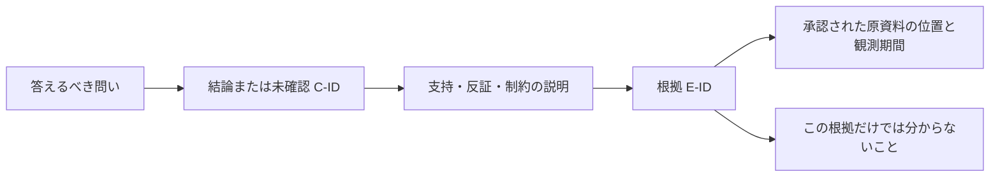

# インフラ分析の結論と根拠を提出物へまとめる手順

更新日：2026-10-08。利用者が挙げた主な負担は、収集ログの解析結果について「結論と証拠を対応付け、提出物にまとめること」。この手順はその工程を対象にする。新しい解析アプリやインフラ収集基盤の実装計画ではない。

## 1. 完成させたいもの

提出先が、各結論について「何を言っているか」「何を見てそう言えるか」「どこまでは分からないか」を追える報告書。既存の提出様式があれば、その様式に根拠IDと未確認点を足す。別の管理サービスや新しいデータベースを導入しない。

最小の成果物は本文と根拠索引の二部分。同じ文書内でもよい。原文ログや実名対応表は、既存の承認された保存場所に置く。提出物へ全量を複製しない。

## 2. 最小の記録

| 記録 | 必要な項目 | 役割 |
| --- | --- | --- |
| 問い | 対象、知りたいこと、期間 | 収集資料を無目的に並べない |
| 結論 C-ID | 資産ID、主張、観測/推定/未確認、根拠ID、制約 | 報告の一文を確認可能にする |
| 根拠 E-ID | 資料の種類、参照位置、収集・観測条件、支持/反証/制約 | ログと結論の距離を説明する |
| 不明点 | 影響、既存資料で確認できるか、追加権限が必要か | 調べていないことを結論へ混ぜない |

IDは報告内での識別子であり、真実性・完全性・改ざん防止を証明するものではない。既存の資産管理IDがあれば使う。別名が必要な場合は、本文と索引で同じものを使う。

## 3. 作業の順序

1. **問いを限定する。** 例えば「この資産は何の役割を持つか」「指定期間に何が動いたか」。稼働、正常性、業務利用、廃止可否を別々の問いにする。
2. **既存の結論を一文ずつ置く。** 既に書いた分析結果を使い、全ログを読み直すことから始めない。根拠が不明な一文も、そのまま未確認として残す。
3. **根拠を一つずつ結ぶ。** 関係は支持・反証・制約のどれかとし、なぜ結び付くかを一文で書く。複数の結論から同じ根拠IDを参照してよい。
4. **参照位置と条件を記録する。** ファイル/検索結果の位置、観測期間、タイムゾーン、フィルタや欠損を、読み手が判断に必要な範囲で記載する。秘密を含むコマンドやURLをそのまま貼らない。
5. **結論を根拠に合わせる。** 単発の200応答を継続稼働や業務利用と言い換えない。設定上の役割と観測した動作が違えば、どちらかを推測で消さず矛盾として残す。
6. **不足だけを一覧にする。** 資料が存在しない、期間が足りない、担当者確認が必要などを整理する。追加収集やアクセスは、この記録から自動実行しない。
7. **提出版を確認する。** 元の問いに答えているか、主張から根拠へ戻れるか、機密・内部パスを開示してよいかを確認する。[マスキング方針](#7-ログと提出物のマスキング方針)に沿って、実際に提出するファイル一式を確認する。

## 4. 加えるアイデア

| 案 | 最初の実現方法 | 狙う効果 | 続けない条件 |
| --- | --- | --- | --- |
| 結論から根拠へ逆向きに確認する | 本文の各主張へC-IDとE-IDを付ける | 根拠のない説明と、使っていない資料を見つける | 既存報告書で既に十分に追跡できる |
| 支持・反証・制約を同じ索引で扱う | 根拠の関係を一列で明記 | 都合のよいログだけを集めることを避ける | 記入の負担が報告レビューを改善しない |
| 観測と推定を明示する | 本文に区分と理由を記載 | 「用途らしい」を「用途である」と断定しない | 読み手の理解に寄与せず様式だけが増える |
| 追加確認事項を提出物から取り出す | 未確認欄から手動で一覧化 | 調査を無限に続けず判断を引き継ぐ | 既存の課題表と二重管理になる |
| 根拠IDの参照漏れをチェックする | 最初は目視。反復時だけ小さなローカル検査を検討 | ID重複・未定義参照・期間未記入を減らす | 一度の報告で終わる、目視の方が軽い |

最後の検査を自動化しても、根拠が主張を支持するかは人が判断する。LLMによる自動結論生成、信頼度スコア、トポロジー自動推定、常時収集は今回の範囲に入れない。

## 5. 一件で試す方法

[未記入の記録型](evaluation/INFRA_REPORT_TEMPLATE.md)と[合成例](evaluation/INFRA_REPORT_EXAMPLE.md)を使う。試用の対象は一つの既存分析結果と、その根拠資料。実資料へのアクセスは対象と権限を確認してから行う。

[合成資料での試用記録](evaluation/INFRA_REPORT_TRIAL.md)では、断定を修正し、マスキングを適用した提出用サンプルまで作成した。これは手順の確認であり、実案件の改善効果の証拠ではない。

記録するのは、元の報告方法で困った対応付け、新しい型を準備・記入・再確認する手間、根拠を探し直した箇所、説明の修正、読み手が未確認事項を区別できたか。新しい型の入力時間だけで便益を判断しない。

完了条件は、合意した問いに対する主要な結論が根拠または未確認へ結び付き、提出先が追跡できる形になること。全資料を網羅することや、根拠IDの数を増やすことは目的にしない。

既存様式への数項目の追加で足りれば、それを完成形にする。繰り返しの機械的な不足だけが残った場合に、小さなローカル検査を別途提案する。分析の意味を自動で証明する製品へ広げない。

## 6. 事業との関係

この手順は、まず業務委託の成果物作成を助けるもの。自分のプロダクトの継続収益になるとはまだ言えない。主力プロダクトの計画を止めず、一つの報告を完成させる範囲で価値を確かめる。

現在の対象選定は、より広い資料整理・暫定設計の[DR-01](TASKS.md#dr-01)へ集約する。IR手順は個別の報告作業を選ぶ場合に参照する。新しい調査・アプリ開発を開始する前に、既存の提出物で解決できるか確認する。

## 7. ログと提出物のマスキング方針

状態：報告作業で使う運用上の定義。自動マスキング機能を実装・検証したものではない。提出先ごとの開示条件はIR-01で確定し、未確定なら提出版の確定を保留する。匿名化後の外部共有も許可されるとは限らない。

### 対象と処理

原資料は既存の承認された保管場所に保全する。本文、ログ抜粋、根拠索引、図、添付、ファイル名・参照URLを含む提出用コピーを処理対象にする。必要な抜粋だけを使い、不要な行や列は含めない。

| 情報の種類 | 提出用コピーの既定処理 | 根拠として残すもの |
| --- | --- | --- |
| パスワード、APIキー、アクセストークン、認証ヘッダ、セッション値、秘密鍵 | 値の全体を固定マーカーでマスク。先頭・末尾・一部文字を残さない。別名や値のハッシュも提出しない | 必要なら認証方式・項目名・発生順序。秘密鍵などは複数行全体を扱う |
| URLの認証情報・署名・秘密を含むクエリ、接続文字列 | 秘密部分を全体マスク。正しく分離できなければ値全体をマスク | 解析に必要かつ開示可能な方式・操作・結果 |
| 氏名、メール、ユーザーID、個人を識別する値 | 原則マスク。関係の説明に必要で開示条件を満たす場合だけ別名化 | 同一対象の関係と、観測した行為 |
| 顧客名、内部ホスト・ドメイン・IP、資産名、内部パス・案件識別子 | 原則マスクまたは別名化。提出先への実値の開示を個別に認めた項目だけ保持 | 資産同士の関係、役割、C-IDとE-IDの対応 |
| リクエスト・レスポンス本文、SQL、自由記述、スタックトレース | 内容を人が確認。未分類部分を含む場合は抜粋縮小・全体マスク・添付保留 | 問いの判断に必要な範囲だけ |
| 時刻、ステータス、件数、処理順序 | 問いに必要で開示可能なら保持。時刻を粗くする場合は変換内容と分析への制約を記載 | 観測条件と順序。保持しても再識別の可能性が残る |

秘密情報が識別子にも該当する場合は全体マスクを優先する。分類不能な値や伏せる範囲の曖昧さを、保持してよい理由にしない。

### 別名と追跡性

- 同じ報告の本文・索引・図・添付では、同じ対象を同じ別名にする。別の対象へ同じ別名を割り当てない。
- 別名は報告一式の中だけで有効とし、別案件へ対応を流用しない。別名化を匿名性の保証と呼ばない。
- 実名との対応は、必要な場合だけ原資料の承認された保管場所で管理し、提出物やこのリポジトリへ入れない。保存先・アクセス範囲・保持期間は既存の組織ルールに従い、未定なら永続保存しない。
- 原資料の位置は内部用索引に保ち、提出先には許可されたE-ID・抜粋・照会方法を示す。マスキングで根拠が判断できなくなった場合は、追加の開示許可を確認するか、結論を限定・未確認へ戻す。

### 作業と最終確認

1. IR-01で提出先・開示可能項目・必要なログ範囲・保管先を決める。外部AI・公開Issue・第三者サービスへの投入も個別の共有経路として扱う。ローカルファイルをAIに読ませる場合も、AIへの入力を認める範囲を確認する。ローカルに保存されていることと外部入力が許可されることは別である。
2. 原資料から提出用コピーを作り、対象カテゴリと変換方法を適用する。原資料、元の報告、ログの収集設定を変更しない。
3. 同じ値の再出現、複数行の秘密、ヘッダ以外の本文・クエリ・エラーへの出現、別名と機密の重なりを確認する。確認記録にはカテゴリと位置を残し、秘密の元値を載せない。
4. 実際の提出用ファイルを開き直し、本文・添付・名前・参照先・確認可能なコメントやメタデータまで確認する。画面だけの伏字や一部のプレビューを、実ファイルの確認の代わりにしない。
5. C-IDからE-IDへ辿れること、時刻・順序・役割の意味を変えていないことを確認する。自動検出を利用した場合も、人の確認を省略しない。現在、この手順に自動検出器は接続していない。
6. 確認した版、処理カテゴリ、意図して保持した項目と理由、未確認箇所、確認担当・確認日を記録する。編集や添付の差し替え後は再確認し、前の確認を引き継がない。

未解決の秘密候補、検査失敗、確認できない添付がある場合は提出候補にしない。マスキングが不要な項目は理由と開示範囲を記録するが、認証秘密の部分保持を例外にしない。確認済みという記録も、漏えいがないことの証明ではない。

### 合成入力で確認する境界

以下は手順確認用の架空値であり、実際の検出・変換結果ではない。

| 合成入力・状況 | 確認する期待結果 |
| --- | --- |
| `Authorization: Bearer DEMO_ONLY_SECRET_A`が二箇所にある | 二箇所とも値全体を`<REDACTED>`にする |
| `https://service.example/path?token=DEMO_ONLY_SECRET_A` | クエリの秘密を全体マスク。判別不能ならURL全体をマスクする |
| 同じホストが本文と添付に現れる | 同じ別名になり、実ホスト名が添付へ戻らない |
| 秘密の複数行ブロックの途中だけを抜粋する | 開始行が抜粋外でも秘密の残片を保持しない。範囲を判断できなければ抜粋を保留する |
| マスク後に役割の根拠が読み取れない | 安全性を理由に断定を残さず、許可された代替根拠または未確認にする |

この方針の整備は、独立した伏字CLIの実装再開を意味しない。実案件に必要なマスキングを既存の承認された手段で行い、反復的な不足が残った場合にだけ、実装の要否を別途判断する。
