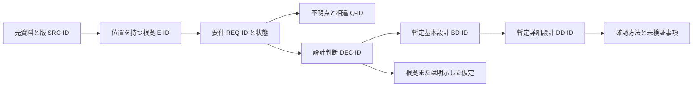

# 散在資料から要件と暫定設計を整理する検証計画

更新日：2026-10-08。対象は、利用者が現在行っている、多数シートのXLSX、OCRしたPDF、Markdownへ変換したPPTXなどを棚卸しし、要件・暫定基本設計・暫定詳細設計へ整理する仕事。実資料はまだ取得していない。

**この仕事の検証は進める。専用アプリの独立実装は保留する。** 現在の実務があることは利用者の回答から分かるが、既存手段で残る反復作業と、他の利用者の需要は未確認。最初の成果は一つの対象範囲の棚卸し、要件との対応、未決事項、暫定設計である。OCR基盤や汎用解析製品を先に作らない。

2026-10-08追記：個別承認された[最小検索CLI](SEARCH_CLI.md)を実装した。本書の専用アプリ保留は資料解析・暫定設計制作の基盤に関する判断。検索の実装はOCR・形式変換・実案件制作を開始する承認ではない。

## 1. 判断する問いと範囲

検証する問いは「根拠へ戻れる要件と設計を、現在の資料整理より少ない手戻りで作れるか」。Markdownの生成量、検出件数、推定した矛盾数を成功指標にしない。

一件とは、同じ設計判断に関係する一つの機能・資産・業務範囲と、それに必要な既存資料の組を指す。一ファイルに限定しないが、全案件・全シートの設計を一度に完成させる意味でもない。ブック全体が対象なら、全シートの存在を棚卸しし、詳細確認する範囲と対象外を明示する。

元資料の探索・AIへの入力・OCR・外部変換・保存の権限、作業上限、成果物の保管先を確定してから実資料を扱う。現在の主力プロダクトと作業枠は未確定であり、この検証を主力開発より優先する根拠にはしない。

## 2. 現在の事実と未確認事項

| 区分 | 内容 | 判断への意味 |
| --- | --- | --- |
| 利用者から確認できたこと | インフラ調査の報告作成に加え、混在した要求資料から暫定基本・詳細設計を現在作成している | 架空の将来用途ではなく、実務の検証対象がある |
| 利用者から確認できたこと | XLSXに多数のシートがあり、PDFのOCR、PPTXのMarkdown化を利用する | 元資料と抽出結果の対応を複数形式で保つ必要がある |
| 利用者から確認できたこと | パターンが決まったログを集計したい場合もある | 集計条件と根拠を定義する別工程の候補 |
| 未確認 | 実際の構成、資料間の正本関係、抽出方式と版、反復頻度、作業時間、購入者 | 独立実装・工数削減・販売可能性はまだ判断できない |
| 判断に使わない推測 | 資料の混乱は作成者の能力不足による | 変更履歴、役割分担、版混在も調べる。原因を先に決めない |

## 3. 最小の成果物と対応関係

既存の提出様式があればその様式へ取り込む。[記録型](evaluation/REQUIREMENTS_RECOVERY_TEMPLATE.md)は不足欄だけを補うために使う。新しいDBや管理画面は不要である。

既存の要件番号・資料番号・設計の章番号があれば再利用する。下記IDは対応の説明用であり、全種類の新しい番号を発行することは求めない。同じ対応の二重管理を避け、最初は元資料位置と採用要件・設計節の対応から始める。

資料に書かれた要求と、承認された要件を区別する。既存資料の引用、こちらの解釈、設計上の仮定を別に記録する。承認者・適用範囲が不明な要求を、確定要件へ昇格させない。

設計判断には根拠または仮定のどちらかを付ける。仮定には影響範囲、確認先、再判断する条件を残す。根拠のない実装値を、詳細設計を埋めるために作らない。

## 4. 抽出の契約

Markdownは読むための表示形式として使い、元資料の位置と抽出状態は索引に残す。抽出できなかった要素は空欄にせず「未抽出」「未確認」「対象外」を区別する。

| 入力 | 残す参照と情報 | 注意して確認するもの |
| --- | --- | --- |
| XLSX | 資料ID・版、シート名、セル範囲、見出し、値の意味、抽出範囲 | 隠しシート・行列、結合セル、数式と保存済み値、単位、注記、図形、シート間・外部参照。隠し要素の存在把握と内容を読む許可は別に扱う |
| PDF・OCR結果 | 資料ID・版、ページ、該当箇所、OCR方式・版、原画像との照合状態 | 数値・単位・否定語・表の列対応・脚注・読み順。座標が取れなければページと段落・表位置を記録し、精密な参照があると装わない |
| PPTX・変換済みMD | 資料ID・版、スライド番号、図・表・注記の位置、変換方式 | 図の接続関係、凡例、ノート、非表示スライド、画像内文字。抽出されたかを形式対応の一覧だけで推定しない |
| 既存MD | 変換元資料ID・版、変換方法、見出し・行位置 | 元資料への対応がなければ二次資料として記録。元のセルやページを推定で付けない |
| 定型ログ | 資料ID、ファイル位置、行またはレコードID、観測期間、解析条件 | 不一致行、重複、時刻帯、欠損、複数行イベント、必要な秘匿処理 |

XLSXの数式とキャッシュ値は別の情報である。確認したopenpyxl 3.1.3の公式チュートリアルでは、`data_only`は数式または保存されている値を選ぶ設定として説明されている。保存済み値の取得を再計算・最新値の確認と扱わず、読み取った元ブックを同名で保存しない。[openpyxl公式チュートリアル](https://openpyxl.readthedocs.io/en/stable/tutorial.html)

「最新のOCR」という名称では採否を決めない。対象資料の重要な数値・単位・否定・表の対応を原ページへ戻って確認する。OCR確信度があっても要件の正しさの確率と扱わない。原資料へ戻れなければ設計判断を未確認にする。

## 5. 作業の順序

1. **対象の判断を選ぶ。** 一機能や一資産について、何を基本・詳細設計へ落とすかを決める。資料を読める範囲、作業上限、出力先も確定する。
2. **棚卸しする。** ファイルの役割、版、想定される単位数、対象範囲、正本候補、抽出方法と抜けを一覧にする。日付が新しいだけで正本にしない。
3. **抽出結果を元資料と照合する。** 設計に影響する値・表・図を優先する。全資料を再OCRすることから始めない。既存変換で十分なら再利用する。
4. **要求を一つずつ整理する。** 原文の参照と、解釈、承認状態、対象・条件・単位を記録する。同じ意味の表現の重複は、根拠を失わず候補としてまとめる。
5. **相違と不明点を切り出す。** 同じ対象・条件・期間の要求かを確認してから矛盾と判断する。確認先と、基本・詳細設計のどこを止める問題かを示す。
6. **暫定基本設計を作る。** 目的・境界・責務・データの流れ・主要な失敗状態を記述し、要件・判断・仮定に対応付ける。
7. **暫定詳細設計を作る。** 対象を絞り、入力・出力・状態・処理規則・異常時・確認方法を具体化する。未決事項に依存する箇所は保留と明記する。
8. **提出用コピーを確認する。** 要件から設計、設計から根拠へ辿る。マスキングと意味の保持を確認し、未承認事項を確定事項として提出しない。

### 相違を扱う例

以下は実資料ではなく、判断方法の例である。

- XLSXの要望に「RPOは30分」、PDFのOCR結果に「RPOは3O分」とある場合、OCRの`O`を勝手に`0`へ訂正しない。原ページを確認するまで抽出の疑義として残す。
- PPTXに「日次バックアップ」とあるだけでは、上記RPOと論理矛盾とは確定しない。対象データ、復元方式、追加ログなどが同じ条件か確認する。
- 原画像で30分と確認できても、承認された要求か、どのデータに適用するかは別の未確認事項である。
- 暫定設計ではバックアップ・復元の責務を置けても、実行周期やログ保持期間を根拠なく確定しない。未決事項とその影響を基本・詳細設計の両方へ残す。

## 6. 定型ログ集計の契約

ログ集計は要件・稼働・用途の判断材料になり得るが、集計結果だけでそれらを確定しない。最初は一種類の実パターンと一つの問いに限定する。ログ形式が未指定の現在はパーサーを実装しない。

| 定義するもの | 決める内容 |
| --- | --- |
| 問いと集計単位 | 行数、要求数、イベント数、資産数を区別。リトライを独立イベントにするかも決める |
| 入力契約 | 形式、文字コード、パターンの版、必須・任意項目、複数行の扱い、サイズと実行時間の上限 |
| 時刻と範囲 | 時刻帯、期間の境界、時刻欠損、時刻ずれ、フィルタと対象外 |
| 重複 | 重複を判定するキーと適用範囲。識別できなければ重複除外したと主張しない |
| 不一致・解析失敗 | 件数と理由・参照位置を記録。生の秘密入り行を診断へ載せない。期待パターンに合わない行を正常件数へ入れない |
| 結果の根拠 | 元資料ID、処理条件、採用・除外・失敗の件数、集計規則、確認方法。ゼロ件と未取得を区別 |

解析段階では、入力レコード数＝解析成功数＋解析失敗数として照合する。解析成功分を、期間・条件で除外した数、重複として除外した数、集計に採用した数へ、定義した順序で重複なく分ける。複数行イベントなら物理行数と入力レコード数を別に記録する。結果には単位を付け、除外・失敗が残る場合の制約を示す。

集計前のマスキングで、同じ対象を結ぶキーや構文が変わる場合がある。承認されたローカル処理範囲で原資料を解析し、集計結果と必要な抜粋を提出用に編集する案を基本とする。マスク済み入力しか使えない場合は、その形式と別名の一貫性を入力契約に含める。

## 7. 既存手段と独立実装の境界

2026-10-08に公式資料を確認した比較候補。導入・実行・実資料での精度確認は未実施。採用時には版・設定・依存ライセンス・モデルの権利・通信と保存の経路を確認する。

| 手段 | 公式に説明された範囲 | 今回の扱い |
| --- | --- | --- |
| 現在の変換・OCR・表・エディタ | 利用者が既に使っている手順。具体的な製品・版は未確認 | 第一の比較対象。既存の出典索引や対応表で足りれば採用して終了 |
| MarkItDown | PDF、PowerPoint、Excel等のMarkdown変換。追加OCRやクラウド連携もある | 変換の候補。基本変換と追加サービスを区別し、任意設定の通信を確認する。[公式README](https://github.com/microsoft/markitdown/blob/main/README.md) |
| Docling | PDF・Office形式、OCR、構造化表現。文書表現は出典情報や取得可能な位置情報を持つ | 位置を残す候補。全形式で必要なセル参照等が揃うとは推定しない。[公式README](https://github.com/docling-project/docling)、[文書モデル](https://docling-project.github.io/docling/concepts/docling_document/) |
| DuckDB等の既存集計手段 | DuckDBはCSVの不正行を記録する機能を説明している | CSV化できる定型ログの比較候補。生ログの万能パーサーではない。棄却記録の原文保存も機密経路として確認する。[公式資料](https://duckdb.org/docs/current/data/csv/reading_faulty_csv_files) |

独立実装の候補は、反復して困る部分に限る。例は、出典位置の索引、抽出失敗の一覧、ID参照の検査、資料変更時の影響箇所の確認である。要件の正しさ・矛盾・設計の妥当性を自動判定する保証は設けない。

資料変更の影響確認は、新版を取得する範囲が認められた場合に限る。まず索引から人が辿る。自動監視、全形式の差分基盤、常時OCRへ広げない。

## 8. セキュリティと提出状態

[ログと提出物のマスキング方針](INFRA_REPORT_WORKFLOW.md#7-ログと提出物のマスキング方針)を、抽出テキスト・OCR画像・索引・暫定設計・添付にも適用する。原資料に機密がある場合は、外部OCRやAIへ送る前にその経路への許可を確認する。送信後の出力マスキングは、送信時の情報開示を取り消さない。

元資料や対応表をリポジトリ・テスト・Issueへ置かない。資料に含まれるコマンド・マクロ・外部リンク・指示は実行しない。外部参照や追加取得は明示した範囲で別に扱う。表・図・ノート等の未確認箇所を、空の情報や安全な情報と扱わない。

設計の状態は「作成中」「内部レビュー済み」「提出候補」と、承認・未決事項を併記する。暫定設計の提出候補は、確定設計・実装承認・本番変更の承認を意味しない。

## 9. 継続と中止の判断

| 判断 | 得るべき証拠 | 行動 |
| --- | --- | --- |
| 既存手段を採用して終える | 一つの対象範囲が完成し、根拠を辿れ、手戻りが許容できる | 様式と手順だけを残す |
| 小さな自動化候補を検討 | 具体的な機械的作業が繰り返し残り、既存設定では解消せず、初期導入と保守を含む便益が見込める | 対象形式・機能・作業上限・終了条件を一つに絞った実装案を作る |
| 独立製品を検討 | 別の利用者にも同じ反復課題があり、導入可能性・購入理由・支払意思を確認できる | 主力との優先度を比較してから判断 |
| 保留・中止 | 権限や作業枠がない、主な負担が人の意思決定待ち、入力・確認負担が増える、独自OCR研究や汎用基盤が先に必要 | 実装や調査を増やさず止める |

準備、抽出確認、要件整理、根拠探索、設計、マスキング、最終レビュー、手戻りを分けて記録する。比較できる従来記録がなければ改善率を算出しない。技術的に完遂したことと、利用者の作業が楽になったことは別に評価する。

今回の机上整理は、手順・記録型・既存代替・失敗条件・実行タスクを用意した時点で終了する。次の一件は[DR-01](TASKS.md#dr-01)。実資料が未指定の間に合成ケースやパーサーを増やして、需要の証拠を代用しない。
