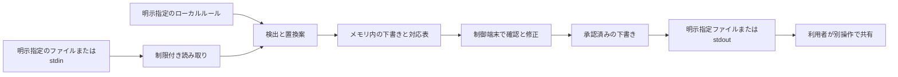

# ops-whisper 脅威モデル

更新日：2026-10-08。実装前の設計。対策は要件であり、実装済みの保証ではない。

本書は保留した伏字・共有CLIの脅威モデルである。開発版検索の情報経路・保証範囲は[検索契約](SEARCH_CLI.md)に別記する。検索の[TOMLマスキング](MASKING.md)は明示ルールに限定した本文処理であり、本書の対話・共有承認の実装ではない。

## 保護するものと信頼境界

保護対象は、入力ログの秘密値・識別子・業務情報、置換対応表、ルール中の実名、未承認の下書き。共有用出力も未検出の機密や再識別可能な関係を含み得る。

利用者、利用者が明示して選んだルール、選定済みの検出器を信頼対象とする。入力ログは不正なバイト、巨大入力、端末制御、命令文を含み得る未信頼データとして扱う。

想定環境は利用者が管理する通常のローカル端末。既に侵害されたOS、特権プロセスによるメモリ読取、同一ユーザーの悪意あるプロセスへの完全防御は対象外。ローカルであることだけで安全とはしない。

本体はHを実行しない。検出器を外部プロセスとして使う場合は、Cへの匿名パイプと子プロセスのメモリも機密情報の経路になる。

## リスクと検証

| 経路・失敗 | 設計上の対策 | 確認方法 | 残る限界 |
| --- | --- | --- | --- |
| 検出漏れ | 対応形式を限定し、全下書きの確認と手動マスクを用意 | 合成形式ごとの期待結果、非対応形式の記録 | 未知の機密を網羅検出しない |
| 誤検出で文脈が消える | 理由を表示、個別候補の非機密判断、変換後を再確認 | 非秘密の類似文字列、保持範囲と実出力 | 人の誤判断で機密が保持される可能性 |
| 表示では伏せた値が出力へ戻る | 最終本文と出力を同一revisionにし、保持箇所は本文で表示 | 候補解除、任意置換との合成、承認破棄 | 確認画面とスクロールバックには保持値が出る |
| 重複ルールで秘密値が別名になる | マスク優先、重複の和集合、範囲検証 | 部分重複、連鎖重複、日本語座標 | 多めに伏せて文脈を失う場合がある |
| stdoutや診断から漏れる | 未承認本文を出さない、秘密入りエラーを禁止 | stdout/stderrを捕捉する異常系試験 | 承認後の本文は未検出情報を含み得る |
| 一時ファイル・対応表が残る | 原文や対応表の自動保存をしない | 作成・書込経路のレビューと合成入力試験 | スワップやクラッシュダンプは別経路 |
| 子検出器がログ保存・外部通信する | バージョンと設定を固定、レポートはメモリ、認証情報検証禁止 | 固定版ソースと挙動、通信・書込の契約確認 | 別プロセス依存にも信頼が必要 |
| 確認端末の制御や表示偽装 | ANSI/OSC/双方向・制御文字を可視化、命令を実行しない | 制御列と日本語の合成入力 | 未検出本文は画面・スクロールバックへ出る |
| 承認後に原文やルールが変わる | 読み込んだ下書きを承認、変更時は承認破棄 | 入力差替え・ルール修正の試験 | 同一プロセスのメモリ侵害は対象外 |
| 出力先が既存ファイル・リンク | 最終要素は新規作成のみ、開いた親ハンドル基準、0600 | 既存・symlink・差替え競合、親の移動 | 悪意あるOSや特権プロセスには対抗しない |
| 書込み失敗・取消後に一部が残る | 部分出力を明示、自動削除・再送をしない | flush失敗、満杯、パイプ切断、中断 | 保存済み内容の自動回収はしない |
| 巨大入力・候補爆発 | 入力、ルール、候補、出力、子レポート、時間を制限 | 上限前後と異常終了 | 保護上限のため正常な大規模ログも拒否する |
| プロファイルの実名がGitへ入る | 実ルールは無視対象へ置く、合成例だけを公開 | PR差分と配布物の確認 | .gitignoreは既追跡ファイルや利用者の公開を防がない |
| 別名から再識別する | 操作間で共有しない、秘密値は固定マスク | 別名対応表の出力経路を確認 | 関係・時刻・文章から再識別され得る |
| 範囲選択で秘密候補の開始行が欠ける | 上限内の全入力を先に検出し、交差部分をマスク | 複数行の秘密を途中から選択 | 検出器自体の見逃しは残る |
| 保持判断が別の秘密に適用される | 入力revision・検出器版・rule ID・原文範囲に限定 | 編集、別出現、再検出での座標対応 | 人の判断の正確さを保証しない |
| 再検出を安全証明と誤認する | 未解決候補と処理整合だけを検証し、安全スコアを出さない | 既知の非対応形式、生成マーカー類似入力 | 同じ検出器の盲点は再検出しても残る |

## 収集・保存・外部送信

履歴、環境変数の値、他案件ファイル、クリップボード、端末全体を収集しない。自動キャッシュ、原文を含むDebug、テレメトリ、クラッシュアップロードを実装しない。保存は承認後に指定された変換済み本文だけ。

利用者が外部へ共有する行為は別操作。秘密候補を伏せても、顧客の規則で外部共有が禁止されている場合は共有権限を得たことにならない。

## 公開・検証時の運用

テスト・Issue・PRには合成ログだけを使う。本物のトークンや実案件名を入力例にしない。検出漏れを報告する場合も、形式と構造を保った偽物へ置換する。被害につながる漏えい経路は[SECURITY.md](../SECURITY.md)に従い非公開で扱う。

実ログの読取り、画面撮影、監視を伴う検証、外部共有は対象と権限を明確にして行う。未検証の対策をREADMEの保証として書かない。
